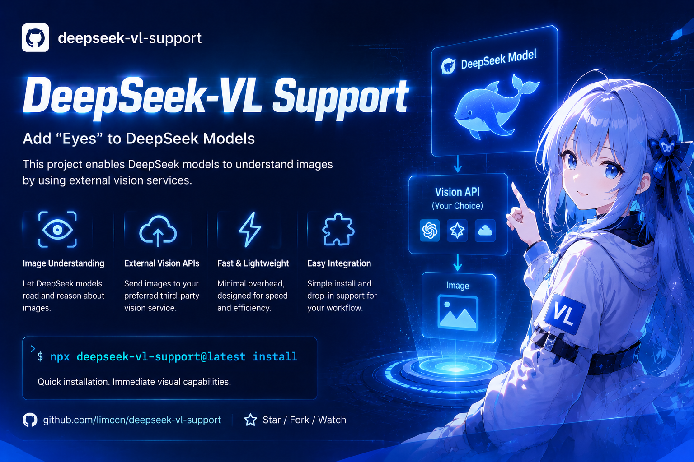

# deepseek-vl-support

> **中文说明** → [docs/README.zh-CN.md](./docs/README.zh-CN.md)

## What this does

Some AI models (like DeepSeek) can read your files, but they **cannot see pictures**.
Screenshots of errors, UI mockups, charts — invisible to them.

This small tool gives them "eyes". Once installed, whenever the model tries to read a
picture, the tool sends it to a vision service of your choice (Moonshot, OpenRouter,
SiliconFlow, Ollama …), receives a detailed text description, and hands it to the model —
as if the model could see the picture.

```
Model reads screenshot.png
  → the tool intercepts the read
  → picture → vision service → detailed text description comes back
  → the model receives: "[Vision of screenshot.png]: <description>"
  → the model answers from the description
```

No model settings to change, no config files to write — it works automatically after a
one-time setup. One command to install, one command to remove. MIT licensed.

## Who this is for

You use a text-only model (such as DeepSeek) in **any AI coding agent or IDE** and want it
to understand pictures: error screenshots, UI mockups, charts, photos of notes. Pick your
tool in the [install wizard](#quick-install-wizard) below — there is a one-command install
for every supported agent, including Claude Code, Codex, Cursor, GitHub Copilot, VS Code,
OpenCode, Trae, Qwen Code, and 14 more.

## Before you start (what you need)

1. **Node.js 18 or newer** — check with `node -v`. Not installed? Get it at
   <https://nodejs.org>.
2. **An account at a vision service, plus its API key** — a vision service is the "eyes
   provider": a website that looks at pictures for you. Cloud options: Moonshot,
   OpenRouter, MiniMax, Zhipu GLM, StepFun, OpenCode Zen, SiliconFlow, DashScope. Free
   local options (run on your own computer): Ollama, llama.cpp, vLLM, LM Studio. The API
   key is a secret code from that service (usually under "API keys"); the installer asks
   for it once and stores it only on your computer.
3. **Your AI agent installed** — any of the supported ones below.

## Quick install wizard

Open a terminal in **your project folder** and run:

```bash
cd path/to/your/project
npx @limccn/deepseek-vl-support@latest install
```

That's the whole install — the wizard auto-detects the agents on your machine and asks 7
short questions. **Almost every question has a sensible default: just press Enter.** The
two that matter: which agents should get vision (pre-selected) and which vision service +
API key to use (choose **Decide later**, the last option, if you want to sort that out
afterwards).

When it finishes, **restart your session** — the installer prints this reminder, and it is
required for the effect to kick in. Optional check:

```bash
npx @limccn/deepseek-vl-support@latest doctor    # look for [OK]
```

Re-running on the same project? It asks whether to keep your current settings — Enter
keeps them.

**No terminal? Ask your agent to install it.** If you use a tool that supports the Agent
Plugins standard (GitHub Copilot, Cursor, Kiro, OpenClaw, Hermes Agent, VS Code, ChatGPT &
Codex, Grok Bot, NanoClaw, and other spec-compliant agents), just say in the conversation:

```
Install the plugin from https://github.com/limccn/deepseek-vl-support and enable it
```

After a GitHub install, configure the vision endpoint once with
`npx @limccn/deepseek-vl-support@latest install --target <your agent>` (or environment variables —
see [Changing settings](#changing-settings)).

### One-command install per agent

Everything below is equivalent to the wizard above — just narrowed to one agent. Pick
yours:

<details>
<summary>Claude Code</summary>

**1. Install**
```bash
npx @limccn/deepseek-vl-support@latest install --target claude
```

**2. After install** — restart your session, then read any picture: the description
arrives automatically (`/vision path.png` for manual use).

</details>

<details>
<summary>Codex</summary>

**1. Ask Codex to install it**
```
Install the plugin from https://github.com/limccn/deepseek-vl-support and enable it
```

**2. Or install via npx**
```bash
npx @limccn/deepseek-vl-support@latest install --target codex
```

**3. After install** — restart Codex, then ask it to describe a picture.

</details>

<details>
<summary>OpenCode</summary>

**1. Install**
```bash
npx @limccn/deepseek-vl-support@latest install --target opencode
```

**2. After install** — restart OpenCode.

</details>

<details>
<summary>Trae</summary>

**1. Install**
```bash
npx @limccn/deepseek-vl-support@latest install --target trae
```

**2. After install** — import the skill once: Settings → Rules & Skills → Create/Import.

</details>

<details>
<summary>Pi Coding Agent</summary>

**1. Native install (recommended)** — skill + extension in one command
```bash
pi install npm:@limccn/deepseek-vl-support
```

**2. Or install via npx**
```bash
npx @limccn/deepseek-vl-support@latest install --target pi
```

**3. After install** — restart Pi.

</details>

<details>
<summary>Oh My Pi</summary>

**1. Native install (recommended)**
```bash
omp install npm:@limccn/deepseek-vl-support
```

**2. Or install via npx**
```bash
npx @limccn/deepseek-vl-support@latest install --target omp
```

**3. After install** — run `/reload-plugins` (no restart needed).

</details>

<details>
<summary>DeepSeek Harness</summary>

**1. Native install (recommended)** — in-process tools, no subprocess
```bash
dsh plugin --profile web add @limccn/deepseek-vl-support@latest
```

**2. Or install via npx**
```bash
npx @limccn/deepseek-vl-support@latest install --target dsh
```

**3. After install** — restart the dsh web session.

</details>

<details>
<summary>Qwen Code</summary>

**1. Install**
```bash
npx @limccn/deepseek-vl-support@latest install --target qwen
```

**2. After install** — restart Qwen Code.

</details>

<details>
<summary>Reasonix</summary>

**1. Install**
```bash
npx @limccn/deepseek-vl-support@latest install --target reasonix
```

**2. After install** — restart Reasonix.

</details>

<details>
<summary>Kilo Code</summary>

**1. Install**
```bash
npx @limccn/deepseek-vl-support@latest install --target kilo
```

**2. After install** — restart Kilo Code.

</details>

<details>
<summary>WorkBuddy (CodeBuddy Code)</summary>

**1. Install**
```bash
npx @limccn/deepseek-vl-support@latest install --target workbuddy
```

**2. After install** — restart WorkBuddy.

</details>

<details>
<summary>Devin</summary>

**1. Install**
```bash
npx @limccn/deepseek-vl-support@latest install --target devin
```

**2. After install** — restart Devin. (Devin's CLI has no official npm package — download
it from <https://devin.ai/download>.)

</details>

<details>
<summary>GitHub Copilot</summary>

**1. Ask Copilot to install it**
```
Install the plugin from https://github.com/limccn/deepseek-vl-support and enable it
```

**2. Or install via npx**
```bash
npx @limccn/deepseek-vl-support@latest install --target copilot
```

**3. After install** — check `copilot plugin list`.

</details>

<details>
<summary>Cursor</summary>

**1. Ask Cursor to install it**
```
Install the plugin from https://github.com/limccn/deepseek-vl-support and enable it
```

**2. Or install via npx**
```bash
npx @limccn/deepseek-vl-support@latest install --target cursor
```

**3. After install** — reload the window (Developer → Reload Window).

</details>

<details>
<summary>Kiro</summary>

**1. Ask Kiro to install it**
```
Install the plugin from https://github.com/limccn/deepseek-vl-support and enable it
```

**2. Or install via npx**
```bash
npx @limccn/deepseek-vl-support@latest install --target kiro
```

**3. After install** — import once: Kiro → Powers → Add Custom Power → Import from folder
→ `~/.deepseek-vl/plugin`.

</details>

<details>
<summary>OpenClaw</summary>

**1. Ask OpenClaw to install it**
```
Install the plugin from https://github.com/limccn/deepseek-vl-support and enable it
```

**2. Or install via npx**
```bash
npx @limccn/deepseek-vl-support@latest install --target openclaw
```

**3. After install** — restart the gateway, verify with `openclaw plugins list`.

</details>

<details>
<summary>Hermes Agent</summary>

**1. Ask Hermes to install it**
```
Install the plugin from https://github.com/limccn/deepseek-vl-support and enable it
```

**2. Or install via npx**
```bash
npx @limccn/deepseek-vl-support@latest install --target hermes
```

**3. After install** — verify with `hermes plugins list`.

</details>

<details>
<summary>VS Code</summary>

**1. Ask in a VS Code chat**
```
Install the plugin from https://github.com/limccn/deepseek-vl-support and enable it
```

**2. Or install via npx**
```bash
npx @limccn/deepseek-vl-support@latest install --target vscode
```

**3. After install** — reload the window.

</details>

<details>
<summary>ChatGPT & Codex</summary>

**1. Ask ChatGPT or Codex to install it**
```
Install the plugin from https://github.com/limccn/deepseek-vl-support and enable it
```

**2. Or install via npx**
```bash
npx @limccn/deepseek-vl-support@latest install --target chatgpt-codex
```

**3. After install** — start a new Codex thread or ChatGPT session.

</details>

<details>
<summary>Grok Bot</summary>

**1. Ask Grok to install it**
```
Install the plugin from https://github.com/limccn/deepseek-vl-support and enable it
```

**2. Or install via npx**
```bash
npx @limccn/deepseek-vl-support@latest install --target grok
```

**3. After install** — press `r` in the Plugins tab or start a new session.

</details>

<details>
<summary>NanoClaw</summary>

**1. Ask NanoClaw to install it**
```
Install the plugin from https://github.com/limccn/deepseek-vl-support and enable it
```

**2. Or install via npx**
```bash
npx @limccn/deepseek-vl-support@latest install --target nanoclaw
```

**3. After install** — run `ncl wirings create` per the printed guidance.

</details>

<details>
<summary>Other agents (Agent Plugins open standard)</summary>

**1. Ask Agent to install it**
```
Install the plugin from https://github.com/limccn/deepseek-vl-support and enable it
```

**2. Or install via npx**
```bash
npx @limccn/deepseek-vl-support@latest install --target other
```

</details>

<details>
<summary>Mixed setup — install for several agents at once</summary>

Any combination works, comma-separated:

```bash
npx @limccn/deepseek-vl-support@latest install --target claude,copilot
```

Or all 10 plugin clients in one run:

```bash
npx @limccn/deepseek-vl-support@latest install --target copilot,cursor,kiro,openclaw,hermes,vscode,chatgpt-codex,grok,nanoclaw,other
```

</details>

All supported agents at a glance:

| Agent | `--target` |
|---|---|
| Claude Code | `claude` |
| Codex | `codex` |
| OpenCode | `opencode` |
| Trae | `trae` |
| Pi Coding Agent | `pi` |
| Oh My Pi | `omp` |
| DeepSeek Harness | `dsh` |
| Qwen Code | `qwen` |
| Reasonix | `reasonix` |
| Kilo Code | `kilo` |
| WorkBuddy (CodeBuddy Code) | `workbuddy` |
| Devin | `devin` |
| GitHub Copilot | `copilot` |
| Cursor | `cursor` |
| Kiro | `kiro` |
| OpenClaw | `openclaw` |
| Hermes Agent | `hermes` |
| VS Code | `vscode` |
| ChatGPT & Codex | `chatgpt-codex` |
| Grok Bot | `grok` |
| NanoClaw | `nanoclaw` |
| Other agents | `other` |

## Try it out

Fastest check — describe a picture directly in the terminal:

```bash
npx @limccn/deepseek-vl-support@latest describe path/to/a/picture.png
```

A good text description comes back → everything is wired up. From then on, just read
pictures in your agent as usual — the description arrives automatically.

## Choosing a vision service

The installer offers the same services as presets — no need to remember these URLs unless
you configure manually:

| Service | base URL | Example model |
|---|---|---|
| Moonshot | `https://api.moonshot.cn/v1` | `moonshot-v1-32k-vision-preview` |
| OpenRouter | `https://openrouter.ai/api/v1` | `qwen/qwen2.5-vl-72b-instruct` |
| MiniMax | `https://api.minimaxi.com/v1` | `MiniMax-VL-01` |
| Zhipu GLM | `https://open.bigmodel.cn/api/paas/v4` | `glm-4v-flash` |
| StepFun | `https://api.stepfun.com/v1` | `step-1o-turbo-vision` |
| OpenCode Zen | `https://opencode.ai/zen/v1` | `mimo-v2.5-free` |
| SiliconFlow | `https://api.siliconflow.cn/v1` | `Qwen/Qwen2.5-VL-72B-Instruct` |
| DashScope | `https://dashscope.aliyuncs.com/compatible-mode/v1` | `qwen-vl-max` |
| Ollama (local) | `http://localhost:11434/v1` | `qwen2.5vl:7b` (run `ollama pull qwen2.5vl:7b` first) |
| llama.cpp (local) | `http://localhost:8080/v1` | `llava` (`llama-server -m llava.gguf`) |
| vLLM (local) | `http://localhost:8000/v1` | `deepseek-ai/deepseek-vl2` |
| LM Studio (local) | `http://localhost:1234/v1` | `qwen2.5-vl-7b-instruct` |

## Everyday commands

| What you want | Command |
|---|---|
| Install | `npx @limccn/deepseek-vl-support@latest install` |
| Health check | `npx @limccn/deepseek-vl-support@latest doctor` |
| Describe a picture now | `npx @limccn/deepseek-vl-support@latest describe picture.png` |
| See current settings | `npx @limccn/deepseek-vl-support@latest config get` |
| Change a setting | `npx @limccn/deepseek-vl-support@latest config set maxBytes 5242880` |
| Remove the tool | `npx @limccn/deepseek-vl-support@latest uninstall` |

## Changing settings

Your answers are saved in `.deepseek-vl/config.json` inside the project folder — usually
you never need to touch it. The two settings worth knowing:

| Setting | Meaning | Default |
|---|---|---|
| `maxBytes` | Pictures bigger than this are skipped (saves time and money) | 10485760 (10 MB) |
| `timeoutMs` | How long to wait for one description | 120000 (2 minutes) |

Example — skip pictures over 5 MB:

```bash
npx @limccn/deepseek-vl-support@latest config set maxBytes 5242880
```

Describing the same picture twice is free: results are cached on your machine (64 MB
limit). Change the picture and it gets described again. Everything can also be set with
environment variables (`VISION_MODEL`, `VISION_BASE_URL`, …) — see
[CLAUDE.md](CLAUDE.md#configuration) for the full reference.

## Troubleshooting

| Symptom | What to do |
|---|---|
| The model still doesn't describe pictures | Restart the session (required after install), then run `… doctor` and look for `[OK]`. |
| `doctor` says no model configured | You chose **Decide later** during install. Configure a model now: `config set model <id>` (plus `config set baseUrl <url>` if not using the default). |
| `doctor` shows "unreachable" / no `[OK]` | The service address or key is wrong — check the base URL ends with `/v1` and the API key is correct. |
| "image too large" hint | Compress or crop the picture (e.g. under 5 MB, long side ~2000 px), or raise the limit with `config set maxBytes …`. |
| Descriptions are slow | Lower the limit or switch to a faster service (see the table above). |
| Pasted (Ctrl+V) pictures are not described | Pasted images bypass the read path — save the picture as a file first, then read it (or use `/vision` / `describe_image`). |

More edge cases (Windows encoding, Codex-specific quirks, reasoning-model notes) live in
[CLAUDE.md](CLAUDE.md) and [docs/README.zh-CN.md](./docs/README.zh-CN.md).

## Acknowledgements

This project was inspired by
[pi-deepseek-vision](https://github.com/psychobarge/pi-deepseek-vision) — thanks to
psychobarge for the open-source work.

## Contributing

Contributions are welcome — see [CONTRIBUTING.md](CONTRIBUTING.md) for how to report
issues and set up a development environment.

## License

[MIT](LICENSE)
