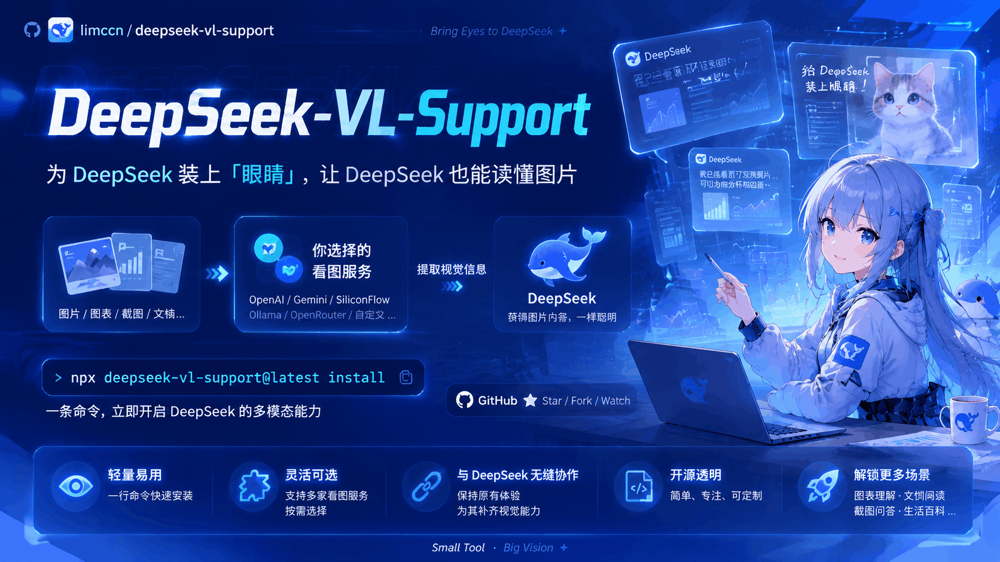

# deepseek-vl-support

> **English** → [README.md](../README.md)

## 它能做什么

有些 AI 模型（比如 DeepSeek）只能读文字：它们能看你的文件，却看不了图片。报错截图、
界面草图、图表、手写笔记照片——这些对它们来说都是"看不见"的。

这个小工具就是给它们装上"眼睛"。装好之后，每当模型想读一张图片，工具会把图片发给一家
你选的"看图服务"（Moonshot、MiniMax、智谱、OpenRouter、Ollama……），拿回一段详细的文字
描述，再把描述交给模型。模型拿着这段描述继续干活，就像真的看见了图片一样。

```
模型(DeepSeek)  Read screenshot.png
  → 本工具在读取时拦截
  → 图片 → 你的看图服务 → 返回详细的文字描述
  → 模型收到："[Vision of screenshot.png]: <详细描述>"
  → 模型继续基于描述推理
```

不用改模型设置，不用写配置文件——一次性设置后全自动运行。一条命令安装，一条命令卸载。
MIT 开源协议。

## 适合谁用

- 你在用 DeepSeek（或其他纯文字）模型，并且用的是下面任一受支持的 agent：
  原生——Claude Code、Codex、OpenCode；技能型——Trae、Pi Coding Agent、
  DeepSeek Harness；Agent Plugins 客户端——GitHub Copilot、Cursor、Kiro、
  OpenClaw、Hermes Agent、VS Code、ChatGPT & Codex、Grok Bot、NanoClaw，
  以及其他符合标准的 agent。
- 你想让模型看懂图片：报错截图、界面草图、图表、手写笔记照片。

## 开始之前（需要准备什么）

1. **Node.js 18 或更高版本。** 在终端运行 `node -v`——能打印出版本号就说明可以了。
   没有的话去 <https://nodejs.org> 安装。
2. **一家看图服务的账号，以及它的 API key。** 看图服务就是帮你"看图片"的网站。可以注册的
   云端服务：**Moonshot**、**OpenRouter**、**MiniMax**、**智谱 GLM**、**StepFun**、
   **OpenCode Zen**、**SiliconFlow（硅基流动）**、**DashScope（阿里云百炼）**。免费的本地
   方案：**Ollama**、**llama.cpp**、**vLLM**、**LM Studio**（这些跑在你自己的电脑上）。
   **API key** 是这家服务发给你的密钥（一般在它网站的"API 密钥"页面里）。安装时问一次，
   只存在你自己的电脑上。
3. 已安装上面任一受支持的 agent——插件客户端、技能型 agent，或
   Claude Code / Codex / OpenCode。

## 安装（大约 2 分钟）

在**你的项目文件夹**里打开终端：

```bash
cd path/to/your/project
npx deepseek-vl-support@latest install
```

**没有 CLI？让 agent 直接从 GitHub 装。** 10 个 Agent Plugins 客户端
（GitHub Copilot、Cursor、Kiro、OpenClaw、Hermes Agent、VS Code、
ChatGPT & Codex、Grok Bot、NanoClaw，以及其他符合标准的 agent）可以自己
安装插件——不需要终端。直接在对话里说（提示词保持英文原样，便于复制）：

> Install the plugin from https://github.com/limccn/deepseek-vl-support and enable it

仓库根目录本身就是 Agent Plugins v1.0.0 插件（`plugin.json` + `mcp.json` +
`skills/`），支持开放标准的 agent 可以直接从 GitHub 仓库地址安装。两点如实
说明：(a) 只适用于上面的 Agent Plugins 客户端——Claude Code、Codex、OpenCode、
Trae、Pi、DeepSeek Harness 不支持该标准，必须走上面的 npx 向导；(b) 从 GitHub
安装只装插件本体，不会生成 `~/.deepseek-vl/config.json`——之后用
`npx deepseek-vl-support@latest install --target <客户端>` 补配视觉端点，或
用环境变量（见[环境变量配置](#环境变量配置)）。各客户端的安装命令见
[Agent Plugins 模式](#agent-plugins-模式10-个兼容客户端)章节。

会出现一个带编号的菜单，共 7 个问题。**大部分都有合适的默认值——直接按回车即可。**

| # | 问题 | 什么意思 | 默认值 |
|---|---|---|---|
| 1 | 哪些 agent 要装视觉？ | 多选（逗号分隔的数字）：`claude`、`codex`、`opencode`、`trae`、`pi`、`omp`、`dsh`、`qwen`、`reasonix`、`kilo`、`workbuddy`、`devin`、`copilot`、`cursor`、`kiro`、`openclaw`、`hermes`、`vscode`、`chatgpt-codex`、`grok`、`nanoclaw`、`other`。选中的 agent 在本机**未检测到**时，安装过程中会打印"install it first"提示——不阻塞，手动指引照常输出 | claude, codex + 本机检测到的 agent |
| 2 | 视觉端点预设 | 用哪家"看图服务"——选你注册了账号的那家（见下方端点表），或选最后一项 **Decide later**（稍后决定）跳过端点配置 | openrouter |
| 3 | 端点地址（Base URL） | 那家服务的地址（预设已帮你填好） | 来自预设 |
| 4 | API key | 那家服务的密钥；只存在你自己的电脑上 | 回车跳过 |
| 5 | 视觉模型 id | 用哪双"眼睛"（预设已帮你填好） | 来自预设 |
| 6 | 兜底模型 | 主服务失灵时的备用"眼睛"（可不填） | 回车跳过 |
| 7 | 安装范围 | 只装这个项目（推荐），还是所有项目。只有选中了原生 agent（`claude`、`codex`、`opencode`、`qwen`、`reasonix`、`kilo`、`workbuddy`、`devin`）时才会问 | project |

**Decide later（稍后决定）**：选择它（或非交互安装时用 `--preset later`）会跳过
端点地址 / API key / 模型 / 兜底模型这些问题——其余照常安装，但安装器会打印：

> Vision not configured: images cannot be described until a model is set.
> （视觉未配置：在设置模型之前无法描述图片。）

之后随时补上：`npx deepseek-vl-support@latest config set model <id>`
（不用默认端点的话再加 `config set baseUrl <url>`），或设置
`VISION_MODEL` / `VISION_BASE_URL` 环境变量。

装完之后：

1. **重启会话**——安装器会打印这条提醒，必须重启才能生效。
2. 可选检查——运行健康检查，看到 `[OK]` 就说明一切正常：

```bash
npx deepseek-vl-support@latest doctor
```

动手前先预览（只打印将要写入的内容，不真正写文件）：

```bash
npx deepseek-vl-support@latest install --dry-run
```

> 提示：请在**你自己的项目文件夹**里运行 `npx deepseek-vl-support@latest …`。在这个工具
> 自己的源码目录里运行会踩到一个已知的 npx 怪癖（`'deepseek-vl-support' is not
> recognized`）——这是运行位置的问题，不是包的问题。

## 试一试

最快的验证方式——直接在终端里描述一张图片：

```bash
npx deepseek-vl-support@latest describe path/to/a/picture.png
```

返回一段像样的文字描述 → 说明一切接线正确。

从此以后：

- **Claude Code**：在会话里 Read 任何图片（png / jpg / jpeg / gif / webp / bmp）——模型会
  自动收到描述。手动方式：`/vision path/to/picture.png "你的问题"`。
- **Codex**：让模型调用 `mcp__deepseek-vl__describe_image(path)`；
  `mcp__deepseek-vl__vision_status()` 显示当前设置和健康检查结果。
  **项目级**的 Codex 安装还会把技能写到项目里的
  `.agents/skills/deepseek-vision/SKILL.md` —— 这是 Codex 技能约定的位置，
  Cursor、GitHub Copilot、Kimi Code 等工具都会从这里读取技能，装完它们也能
  用上视觉。（全局级安装不写这个文件。）

## 端点参考

| 端点 | base URL | 示例模型 |
|---|---|---|
| Moonshot | `https://api.moonshot.cn/v1` | `moonshot-v1-32k-vision-preview` |
| OpenRouter | `https://openrouter.ai/api/v1` | `qwen/qwen2.5-vl-72b-instruct` |
| MiniMax | `https://api.minimaxi.com/v1` | `MiniMax-VL-01` |
| Zhipu GLM 智谱 | `https://open.bigmodel.cn/api/paas/v4` | `glm-4v-flash` |
| StepFun | `https://api.stepfun.com/v1` | `step-1o-turbo-vision` |
| OpenCode Zen | `https://opencode.ai/zen/v1` | `mimo-v2.5-free` |
| SiliconFlow 硅基流动 | `https://api.siliconflow.cn/v1` | `Qwen/Qwen2.5-VL-72B-Instruct` |
| DashScope 阿里云百炼 | `https://dashscope.aliyuncs.com/compatible-mode/v1` | `qwen-vl-max` |
| Ollama（本地） | `http://localhost:11434/v1` | `qwen2.5vl:7b`（先 `ollama pull qwen2.5vl:7b`） |
| llama.cpp（本地） | `http://localhost:8080/v1` | `llava`（`llama-server -m llava.gguf`） |
| vLLM（本地） | `http://localhost:8000/v1` | `deepseek-ai/deepseek-vl2` |
| LM Studio（本地） | `http://localhost:1234/v1` | `qwen2.5-vl-7b-instruct` |

## 常用命令速查

| 想做什么 | 命令 |
|---|---|
| 安装 | `npx deepseek-vl-support@latest install` |
| 健康检查 | `npx deepseek-vl-support@latest doctor`（加 `--all` 连兜底模型一起检查） |
| 现在就描述一张图片 | `npx deepseek-vl-support@latest describe picture.png` |
| 查看当前设置 | `npx deepseek-vl-support@latest config get` |
| 修改一项设置 | `npx deepseek-vl-support@latest config set maxBytes 5242880` |
| 卸载 | `npx deepseek-vl-support@latest uninstall` |
| 卸载并删除设置 | `npx deepseek-vl-support@latest uninstall --purge-config` |

## 修改设置

你的回答保存在项目文件夹里的 `.deepseek-vl/config.json`。一般永远不用动它。值得知道的
两项设置：

| 设置 | 含义 | 默认值 |
|---|---|---|
| `maxBytes` | 超过这个大小的图片会被跳过（省时省钱） | 10485760（10 MB） |
| `timeoutMs` | 等一次描述要多久 | 120000（2 分钟） |

示例——跳过超过 5 MB 的图片：

```bash
npx deepseek-vl-support@latest config set maxBytes 5242880
```

同一张图片描述两次是免费的：结果缓存在你的电脑上（上限 64 MB）。图片变了才会重新描述。

## 环境变量配置

所有设置都可以不写配置文件、直接用环境变量。它对所有消费者一视同仁——Claude
Code 钩子、插件客户端启动的 MCP 服务器、`describe` CLI 读的都是同一份合并后
的配置——改完环境变量也**不需要重跑安装**。

| 变量 | 作用 | 示例值 |
|---|---|---|
| `VISION_BASE_URL` | 看图服务地址 | `https://api.moonshot.cn/v1` |
| `VISION_MODEL` | 视觉模型 id | `moonshot-v1-32k-vision-preview` |
| `VISION_API_KEY` | 你的 API key | `sk-...` |
| `VISION_TIMEOUT_MS` | 等一次描述多久（毫秒） | `120000` |
| `VISION_MAX_BYTES` | 超过这个大小的图片会被跳过 | `10485760` |
| `VISION_FALLBACKS` | 兜底模型（`model@baseUrl`，逗号分隔） | `qwen/qwen2.5-vl-72b-instruct@https://api.siliconflow.cn/v1` |
| `VISION_DISABLE` | 整体关闭视觉（`1` / `true`） | `1` |

优先级：环境变量逐字段覆盖配置文件——`VISION_*` > 项目 `.deepseek-vl/config.json`
> 全局 `~/.deepseek-vl/config.json` > 内置默认值。这也是通过 GitHub 提示词安装
插件（不生成配置文件）之后最简单的补配方式。

Bash：

```bash
export VISION_BASE_URL="https://api.moonshot.cn/v1"
export VISION_MODEL="moonshot-v1-32k-vision-preview"
export VISION_API_KEY="sk-..."
```

PowerShell：

```powershell
$env:VISION_BASE_URL = "https://api.moonshot.cn/v1"
$env:VISION_MODEL = "moonshot-v1-32k-vision-preview"
$env:VISION_API_KEY = "sk-..."
```

## 故障排查

| 现象 | 怎么办 |
|---|---|
| 模型还是不描述图片 | 1) 重启会话（安装后必须重启）。2) 运行 `… doctor`，看有没有 `[OK]`。 |
| `doctor` 显示 "VISION_MODEL not set" / 未配置模型 | 安装时选了 **Decide later**。现在补上：`config set model <id>`（不用默认端点的话再加 `config set baseUrl <url>`），或设置 `VISION_MODEL` / `VISION_BASE_URL` 环境变量（见[环境变量配置](#环境变量配置)）。 |
| `doctor` 显示 "unreachable" 或没有 `[OK]` | 服务地址或密钥不对：确认 base URL 以 `/v1` 结尾、API key 正确。（如果服务不公开模型列表，`doctor` 会改为显示警告——只要说 reachable 就没问题。） |
| 提示 "image too large" | 图片超限了——先压缩或裁剪（比如 5 MB 以内、长边约 2000 像素），或者用 `config set maxBytes …` 调大限制。 |
| 描述很慢 | 调低限制（`config set maxBytes 5242880`），或换一个更快的端点。 |
| 粘贴（Ctrl+V）的图片不被描述 | 粘贴的图片不走 Read 通道——先把图片存成文件再 Read（或用 `/vision` / `describe_image`）。 |
| Codex 里看不到 `mcp__deepseek-vl__*` 工具 | Codex 的一个已知 bug 会隐藏它们。安装器会自动修复；手动修复：在 `~/.codex/models.json` 里把 DeepSeek 条目的 `"supports_search_tool"` 设为 `false`。 |
| Codex 第一次调用工具要批准 | 任何 MCP server 都会这样——点一次 Allow 即可。非交互 `codex exec` 场景请改用 `deepseek-vl-support describe <file>`。 |
| Windows 终端显示乱码 | 运行 `chcp 65001`，或改用 Windows Terminal / VS Code 终端。 |
| DeepSeek v4-r1 / 推理模型用不了 | 推理模型不支持调用工具。Codex 里使用 `[model_providers.deepseek] wire_api = "chat"` 并搭配非推理模型；视觉端也建议用非推理视觉模型。 |
| 没反应，模型只看到 `[Unsupported Image]` | 视觉被关掉了（`VISION_DISABLE=1` 或配置里 `enabled: false`）——打开开关即可恢复。 |

## 进阶用法（可选）

完整设置示例（`.deepseek-vl/config.json`，可用 `deepseek-vl-support config set <key> <value>`
修改）：

```jsonc
{
  "baseUrl": "https://api.moonshot.cn/v1",
  "model": "moonshot-v1-32k-vision-preview",
  "apiKey": "sk-...",                    // 可省略；只存在 .deepseek-vl/config.json
  "timeoutMs": 120000,                   // 单次请求超时（兜底链共享总预算）
  "maxBytes": 10485760,                  // 超过此大小的图片会被跳过
  "fallbacks": [
    { "model": "Qwen/Qwen2.5-VL-72B-Instruct", "baseUrl": "https://api.siliconflow.cn/v1" },
    { "model": "qwen2.5vl:7b" }          // 缺省字段继承主配置
  ]
}
```

- **兜底模型**：主服务失败（网络错误 / 超时 / 空回答）时按顺序换下一个，共享一个时间预算。
  `doctor --all` 逐个检查。
- **环境变量**逐字段覆盖配置文件：见[环境变量配置](#环境变量配置)章节；
  安装参数 `DVLS_TARGET` / `DVLS_SCOPE` 同理。
- **查看 / 修改配置**：`config get [key]` / `config set <key> <value>` / `config path`。
- **自定义提示词（Claude Code 技能）**：项目 `.deepseek-vl/vision-prompt.md` > 全局 > 内置默认。
- **Codex 项目级安装需先信任项目**：codex 只在已信任目录加载项目级 MCP 配置；项目级安装后
  请先在交互式会话中信任该项目，CI / 非交互场景请改用 `--global` 安装。
- **非交互 / CI 安装**（无菜单，全部用参数）：

```bash
npx deepseek-vl-support@latest install --non-interactive \
  --target claude,codex --preset custom \
  --base-url https://api.moonshot.cn/v1 --model moonshot-v1-32k-vision-preview \
  --api-key sk-... --fallbacks "qwen/qwen2.5-vl-72b-instruct@https://openrouter.ai/api/v1"

# 完全跳过端点配置（等同向导里的 Decide later）
npx deepseek-vl-support@latest install --non-interactive --target opencode --preset later
```

`--target` 接受逗号分隔的 agent 列表（`claude`、`codex`、`opencode`、`trae`、
`pi`、`omp`、`dsh`、`qwen`、`reasonix`、`kilo`、`workbuddy`、`devin`、
`copilot`、`cursor`、`kiro`、`openclaw`、`hermes`、`vscode`、`chatgpt-codex`、
`grok`、`nanoclaw`、`other`），默认 `claude,codex` + 本机检测到的
agent。任意组合都支持——例如 `--target claude,copilot` 一次运行同时装好 Claude
Code 钩子并注册 Copilot 插件。要跳过端点配置，传 `--preset later`。

## 技能型 agent（OpenCode / Trae / Pi / Oh My Pi / DeepSeek Harness）

这五个 agent 读取 [Agent Skills](https://agent-skills.org) 技能，但没有实现
Agent Plugins 开放标准，因此有各自的集成方式（`--target opencode,trae,pi,omp,dsh`）。
OpenCode 是原生 agent，它的产物（`opencode.json` + 共享技能）随你选择的安装范围
（项目/全局）而定。技能 agent（trae/pi/omp/dsh）**只支持项目级安装**，永远
不会触发安装范围问题：

| Agent | 安装器做什么 | 验证 / 说明 |
|---|---|---|
| OpenCode（`opencode`） | 在 `opencode.json` 写入 MCP 条目（`mcp.deepseek-vl`，`type: local`，`npx -y deepseek-vl-support mcp`，`enabled: true`）+ 共享 `.agents/skills/` 技能。按安装范围写项目级或全局级文件；文件做深合并（你的其他键和 MCP 服务器绝不改动），首次修改前备份为 `opencode.json.bak` | OpenCode 原生读取 `.agents/skills/`；重启 OpenCode 后让它描述一张截图 |
| Trae（`trae`） | 技能复制到 `.trae/skills/deepseek-vision/` + 手动导入指引（Settings → Rules & Skills → Create/Import）+ 可选的手动 MCP 配置（Settings → MCP） | Trae 是 IDE——没有 CLI 自动化；MCP 条目需要手动（Trae 的配置路径未验证） |
| Pi Coding Agent（`pi`） | 共享 `.agents/skills/` 技能；指引首选原生安装（`pi install npm:deepseek-vl-support`）——一条命令给 pi 用户级技能；**仅当检测到 pi-mcp-adapter 扩展**（存在 `~/.pi/agent/mcp.json` 或 `~/.pi/agent/npm/`）时才写 `mcpServers.deepseek-vl` 到 `~/.pi/agent/mcp.json` | pi 核心没有 MCP——随包技能无需 MCP 即可用；想要 MCP 工具再装适配器（`pi install npm:pi-mcp-adapter`），重启 pi |
| Oh My Pi（`omp`） | 共享 `.agents/skills/` 技能（omp 以 70 优先级读取）+ 指引 `omp install npm:deepseek-vl-support`——一条命令同时获得技能**和**自动 MCP 工具（自动注册包内 `.mcp.json`）；不写任何配置文件（omp 用户级 MCP 路径未验证） | omp 是带内置 MCP 的 pi fork；`/reload-plugins` 即时生效，无需重启 |
| DeepSeek Harness（`dsh`） | 共享 `.agents/skills/` 技能（dsh 以 200 优先级读取 `<project>/.agents/skills`）+ MCP 指引（开发预览版 `@deepseek-ai/dsh-mcp-client` 插件，写 `cordis.patch.yml`） | MCP 是手动的——dsh 没有内置 MCP 支持 |

0.2.3 起新增 5 个 CLI agent 的原生支持（`--target qwen,reasonix,kilo,workbuddy,devin`）。
全部按安装范围支持项目级/全局级；每次文件修改都是 JSON 深合并（绝不改动外来键，
首次修改前备份 `.bak`），重复安装幂等：

| Agent | 安装器做什么 | 验证 / 说明 |
|---|---|---|
| Qwen Code（`qwen`） | 技能复制到 `.qwen/skills/deepseek-vision/` + `settings.json` 写 `mcpServers.deepseek-vl`（npx）+ `PreToolUse` 钩子（matcher `Read`），把图片读取路由到 MCP 服务器（`node "<hook.cjs 绝对路径>"`）；全局级用 `~/.qwen/` | Qwen **不读** `.agents/skills/`，所以技能放在 `.qwen/skills/`；带注释（JSONC）的 `settings.json` 报告为 manual——文件字节不动 |
| Reasonix（`reasonix`） | 共享 `.agents/skills/` 技能 + 项目 `.mcp.json` 的 `mcpServers` 条目 + `.reasonix/settings.json` 钩子；全局级在 `~/.reasonix/config.toml` 写 `[[plugins]]` 块 + `~/.agents/skills/` | 插件块用 `# deepseek-vl-support:start/end` 托管标记包裹，原位更新；不带我们标记的外部块原样保留（manual） |
| Kilo Code（`kilo`） | 共享 `.agents/skills/` 技能 + 项目 `.kilo/kilo.json` 写 `mcp.deepseek-vl`（`type: local`，命令为**数组** `["npx","-y","deepseek-vl-support","mcp"]`，`enabled: true`）；全局级探测 `~/.config/kilo/kilo.json` 再 `kilo.jsonc`，写入已存在者 | Kilo 用的是 `mcp` 键（不是 `mcpServers`）；两者都不存在时创建 `kilo.json` |
| WorkBuddy / CodeBuddy Code（`workbuddy`） | 技能复制到 `.codebuddy/skills/deepseek-vision/` + 项目 `.mcp.json` 的 `mcpServers` 条目（`type: stdio`）；全局级用 `~/.codebuddy/.mcp.json` | 与 Reasonix 共享项目 `.mcp.json`——任一方的条目另一方视为已存在；JSONC 的 `.mcp.json` 报告为 manual（字节不动） |
| Devin（`devin`） | 共享 `.agents/skills/` 技能 + 项目 `.devin/mcp_config.json` 写 `mcpServers` 条目；全局级用 `%APPDATA%\devin`（win32）或 `~/.config/devin`（posix） | Devin CLI 没有官方 npm 包——`https://devin.ai/download` |

选中的 agent 在本机未检测到时，安装时非阻塞地提示：
`⚠ <Label> was not detected on this machine — install it first (<hint>).`

卸载归属：`uninstall --target opencode|pi|omp|dsh` 只移除各自专属的文件（opencode.json /
mcp.json 中的条目），**保留**共享的 `.agents/skills/deepseek-vision/` 目录——其他
agent 可能还在用。新增的 CLI agent（qwen/reasonix/kilo/workbuddy/devin）遵循同样规则，
qwen/workbuddy 还会移除自己的技能副本（`.qwen/skills/`、`.codebuddy/skills/`）和钩子文件。
只有 `uninstall --target codex` 会删除共享技能目录（或手动删目录）。

## Pi 与 Oh My Pi 原生包

自 0.2.4 起，npm 包与本仓库同时作为这两个 agent 的原生插件——无需向导：

### Pi Coding Agent

```bash
pi install npm:deepseek-vl-support          # 已发布包
pi install git:github.com/limccn/deepseek-vl-support@<tag>   # 从 git 安装（钉版本）
```

- 获得什么：用户级的 `deepseek-vision` 技能（pi 只加载其 `pi` 清单列出的资源——
  `"pi": { "skills": ["./skills"] }`）。技能自包含：内部调用
  `npx deepseek-vl-support describe`，不依赖任何 MCP 配置即可工作。
- **不含** MCP 工具——pi 核心没有 MCP。想要 `describe_image` / `vision_status`
  工具就装社区适配器（`pi install npm:pi-mcp-adapter`，重启 pi）后重跑安装器，
  或走向导的 adapter 感知路径。
- 卸载：`pi remove deepseek-vl-support`（适配器是独立包——用
  `pi remove pi-mcp-adapter` 单独移除）。
- 注意：装完要重启 pi；项目级技能首次运行需信任项目。若已通过向导装过项目级技能，
  包技能与其等效，无需重复安装。

### Oh My Pi

```bash
omp install npm:deepseek-vl-support         # 已发布包
omp install github:limccn/deepseek-vl-support@<tag>  # 从 git 安装（钉版本）
```

- 获得什么：`deepseek-vision` 技能**和**自动 MCP 工具——omp（内置 MCP 的 pi fork）
  读取包内 `.mcp.json` 并注册 `deepseek-vl` 服务器（`describe_image` /
  `vision_status`）。`/reload-plugins` 即时生效，无需重启。
- omp 回退读取 `pi` 清单键，所以同一个包两个 agent 都能用；它也读项目
  `.agents/skills/` 共享目录（优先级 70），向导装的项目技能同样生效。
- 卸载：`omp plugin uninstall deepseek-vl-support`。
- 注意：omp 迭代极快——若未来版本不再接受 `pi` 键回退，请反馈；向导路径
  （共享技能 + 指引）无论如何都继续可用。

## Agent Plugins 模式（10 个兼容客户端）

除了 Claude Code 和 Codex，本包还以 [Agent Plugins v1.0.0](https://agent-plugins.org)
可移植插件的形式发布（仓库根目录 `plugin.json` + `mcp.json` +
`skills/deepseek-vision/SKILL.md`）。
支持插件的智能体也可以获得视觉能力：
`deepseek-vision` 技能 + `describe_image` / `vision_status` 两个 MCP 工具，
共用同一套端点配置。MCP 服务器以 `npx -y deepseek-vl-support mcp` 启动
（环境需包含 npm/npx），并附带与 `mcp.json` 逐字节一致的 `.mcp.json`
以适配 Copilot 的原生 MCP 约定。

```bash
# 一键安装：把插件目录复制到 ~/.deepseek-vl/plugin/ 并注册到所选客户端
#（向导菜单默认勾选检测到的客户端）
npx deepseek-vl-support@latest install --target copilot,cursor,kiro,openclaw,hermes,vscode,chatgpt-codex,grok,nanoclaw,other

# 非交互：同样效果，也可以把插件 agent 与原生 agent 混装
npx deepseek-vl-support@latest install --target claude,copilot
```

旧版 `--clients copilot,cursor` 参数仍然可用，作为非交互安装中插件 agent 的过滤器
（生效的插件 agent = `--target ∩ --clients`）；`--target plugin` 已移除——直接列出
插件 agent 即可。

各客户端行为：

| 客户端 | 安装 | 验证 | 卸载 |
|---|---|---|---|
| GitHub Copilot | `copilot plugin install` + marketplace add（CLI 缺失时回退为写 `~/.copilot/settings.json` 的 `enabledPlugins`） | `copilot plugin list`，然后在会话里让它描述截图 | `copilot plugin uninstall deepseek-vl-support` |
| Cursor | 复制插件目录到 `~/.cursor/plugins/local/deepseek-vl-support/`（带标记） | Developer → Reload Window 后技能 / MCP 服务器出现 | 重跑安装器的卸载（只删带标记的目录） |
| Kiro | 手动——Kiro 没有命令行自动化入口 | Kiro → Powers 面板 → Add Custom Power → Import power from a folder → 选择 `~/.deepseek-vl/plugin` | 同一面板移除该 power |
| OpenClaw | `openclaw plugins install ~/.deepseek-vl/plugin` + `openclaw gateway restart` | `openclaw plugins list`，然后让它描述截图 | `openclaw plugins uninstall deepseek-vl-support` |
| Hermes Agent | `hermes plugins install limccn/deepseek-vl-support --no-enable` + `hermes plugins enable deepseek-vl-support` | `hermes plugins list`，确认技能可被发现 | `hermes plugins uninstall deepseek-vl-support` |
| VS Code | 无需 CLI——在用户 `settings.json` 里写入 `chat.pluginLocations["~/.deepseek-vl/plugin"] = true`（首次修改会备份为 `.bak`） | 重载窗口后技能 / MCP 服务器出现 | 安装器的卸载只删除我们的 `chat.pluginLocations` 条目 |
| ChatGPT & Codex | 本地 marketplace 垫片放在 `~/.deepseek-vl/marketplace/` + `codex plugin marketplace add` + `codex plugin add deepseek-vl-support@deepseek-vl-support`（没有 `codex` CLI 时改为指引） | 新开一个 Codex 线程（或 ChatGPT 会话），技能 / MCP 工具即可加载 | `codex plugin remove deepseek-vl-support@deepseek-vl-support`（marketplace 注册保留） |
| Grok Bot | `grok plugin install ~/.deepseek-vl/plugin --trust`（没有 `grok` CLI 时改为指引） | 在 Plugins 页按 `r` 或新开会话；用 `grok inspect` 验证 MCP 工具 | `grok plugin uninstall deepseek-vl-support --confirm` |
| NanoClaw | 复制插件到 `~/.deepseek-vl/nanoclaw-templates/`（NanoClaw 拒绝符号链接——永远用复制）+ `ncl groups create --template deepseek-vl-support --name "DeepSeek Vision"`（没有 `ncl` CLI 时改为指引） | 印章（stamping）不会自动接线通道——需运行 `ncl wirings create`；任务默认暂停 | 手动——NanoClaw 没有插件卸载（删除印章组即可） |
| Other（任意兼容 Agent Plugins 标准的智能体） | 物化插件目录并打印 Agent Plugins 开放标准的通用安装指引 | 见打印出的指引 | 手动——按安装时的步骤反向操作 |

`chatgpt-codex` 是原生 `codex` 目标的插件模式对应物（MCP 配置 + AGENTS.md）：
想让 Codex 在所有上下文里都能看图，可以两个都装。marketplace 垫片位于物化插件
目录**之外**（`~/.deepseek-vl/marketplace/`，不是 `~/.deepseek-vl/plugin/`），
物化目录始终保持恰好四个规范条目。

单个客户端失败不会阻塞其他客户端——安装器逐客户端报告并给出指引（失败通常只是
「重启应用」或一条手动命令）。

插件客户端的配置是**环境变量或全局级别**：只要安装包含插件 agent，就会写入
`~/.deepseek-vl/config.json`（插件 agent 没有项目/全局选择——例如 `claude,copilot`
混合安装时 Claude 钩子按项目作用域安装，但端点配置写全局），客户端启动的 MCP
子进程能看到 `VISION_*` 环境变量。项目级 `.deepseek-vl/config.json` 对它们不可见——
请用 `npx deepseek-vl-support@latest config set <key> <value> --global` 或
`VISION_BASE_URL` / `VISION_MODEL` / `VISION_API_KEY`。

卸载会撤销注册并保留已物化的插件目录：

```bash
npx deepseek-vl-support@latest uninstall --target copilot,cursor,kiro,openclaw,hermes,vscode,chatgpt-codex,grok,nanoclaw,other   # 保留配置
npx deepseek-vl-support@latest uninstall --target copilot,cursor,kiro,openclaw,hermes,vscode,chatgpt-codex,grok,nanoclaw,other --purge-config   # 连同配置/缓存一起删除
```

## 开发者

```bash
npm install            # 仅 devDependencies：typescript esbuild @types/node
npm run build          # esbuild → dist/cli.js + dist/hook.cjs + assets/
npx tsc --noEmit       # 类型检查
node --test tests/     # 基于 mock 的自动化测试（需先 build）
```

真实端点端到端手册见 `e2e-real-endpoint.md`；发布流程见 `releasing.md`。

## 致谢

本项目灵感来自 [pi-deepseek-vision](https://github.com/psychobarge/pi-deepseek-vision)，
感谢原作者 psychobarge 的开源工作。

## 协议

[MIT](../LICENSE)
